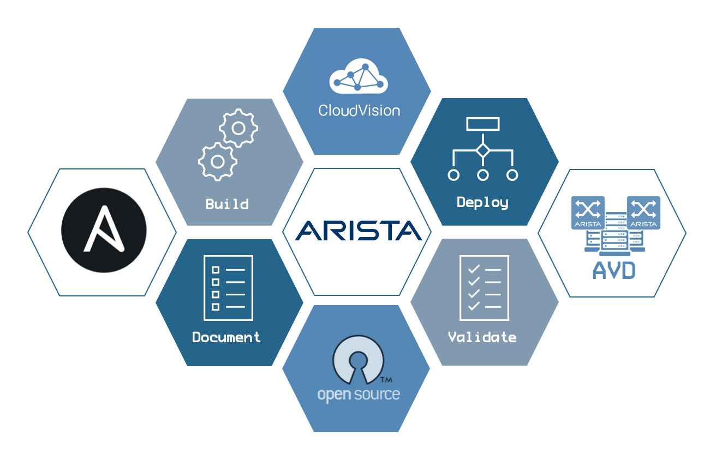
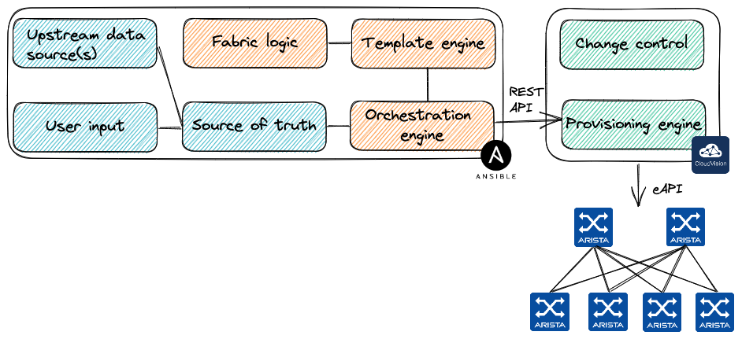

# AVD Provisioning on CVaaS

<!-- Do not add page number on this slide -->
<!--
_paginate: false
-->

```text
Provisioning Workflow Demo
Petr Ankudinov
                                      Sep 2023
```



---

# $ whoami

<style scoped>section {font-size: 18px;}</style>

<!-- Add footer starting from this slide -->
<!--
footer: ''
-->

- Petr Ankudinov [github.com/ankudinov](https://github.com/ankudinov)

  - Advanced Services Engineer at Arista Networks
  - Over 20 years of experience in IT with a bit of everything
  - ACE: L5, CCIE 37521
  - Passionate DC and network automation engineer
  - Daily (and nightly) VSCode user


---

# Agenda

<style scoped>section {font-size: 22px;}</style>


- Ansible AVD collection overview
- tbd

---

# Credits and References

<style scoped>section {font-size: 12px;}</style>

<!-- Add footer starting from this slide -->
<!--
footer: ''
-->

This repository is based on many awesome open source repositories and some free/commercial Github features:

Tool | Purpose
-----|------------
[VS Code](https://code.visualstudio.com/) | create this repository code
[DevContainers](https://code.visualstudio.com/docs/remote/containers) | our topic for today
[Marpit](https://marp.app/) | Markdown slide deck framework
[Github Actions](https://github.com/features/actions) | build slides and containers
[Github Pages](https://pages.github.com/) | publish slides
[Github Packages](https://github.com/features/packages) | publish containers
[Github Codespaces](https://github.com/features/codespaces) | run the demo container
[Carbon](https://carbon.now.sh/) | code snippets
[Pexels](https://www.pexels.com/) and [Unsplash](https://unsplash.com/) | Excellent free stock photos resources. It's not possible to reference every author individually, but their work is highly appreciated.
[excalidraw](https://github.com/excalidraw/excalidraw), [drawio](https://github.com/jgraph/drawio), [tldraw](https://github.com/tldraw/tldraw) | VSCode plugins to create drawings
[Containerlab](https://containerlab.dev) | Orchestration tool for container based networking labs
[Arista AVD Ansible Collection](https://avd.arista.com/4.3/index.html) | Ansible collection used to build EVPN network
[Ansible](https://www.ansible.com) | Automation for everyone.

---

# What is Ansible AVD?

<style scoped>section {font-size: 20px;}</style>



- [AVD](https://avd.arista.com/) stands for Arista Validated Design as it was based on the [EVPN Deployment Guide](https://www.arista.com/custom_data/downloads/?f=/support/download/DesignGuides/EVPN_Deployment_Guide.pdf)
- A very successful community project used to deploy EVPN based Data Center fabrics
  - Over [200 stars on Github](https://github.com/aristanetworks/ansible-avd) and 79 contributors as of Sep 2023
  - The most active Arista collection on [Ansible Galaxy](https://galaxy.ansible.com/arista/avd)
- High level workflow:
  - Define abstracted group/host vars using AVD data model
  - Generate low level device specific variables (aka structured configs)
  - Parse templates, build plain text configs
  - Deliver configs to network devices using Ansible `arista.eos.eos_config`
